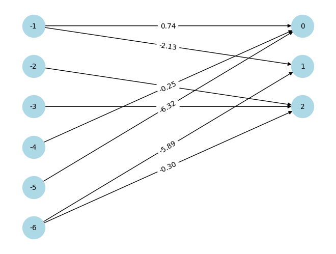

# 2D car game with NEAT

# Abstract

In this project, a minimalistic car game was developed. The aim of the game is to avoid incoming traffic and reach the highest score possible. The goal was to use a generational algorithm in order to develop an agent that would be able to play the game. The NEAT algorithm was chosen for this task.

# Demo of 300th generation

Best genome visualization:

# installation & setup

    $ git clone https://github.com/BouzoulasDimitrios/Neat-2D-car-game.git
    
    $ cd Neat-2D-car-game/

    $ pip install -r requirements.txt

    $ python3 main.py

# Detailed explanaition

### why chose NEAT?

In this game, the algorithm of choice is [NEAT](https://neat-python.readthedocs.io/en/latest/neat_overview.html). NEAT was chosen as it can solve simple reinforcement learning tasks extremely well. The game requires the players to move right, left, or stay in place in order to avoid incoming vehicles. Every car has 6 distance lasers, these lasers serve as our 'game state'. The lasers are fed to the neural networks, and an action is taken as an output. This results in an initial network with 6 inputs and 3 outputs, as can be observed in the visualization above. In the above visualization, we can see why NEAT is so good at solving small problems like this game. Without the use of any hidden nodes, NEAT was able to develop a genome that's able to play the game.

Unwanted behavior:

### configuration details

The configurations used are similar to the standard config file suggested by [NEAT-Python](https://neat-python.readthedocs.io/en/latest/xor_example.html). The main changes were the number of inputs and outputs, as they needed to fit the game's inputs and outputs. Additionally, the main other change made was the fitness_criterion parameter. During the initial training, the fitness_criterion was set to max, which led to the development of poorly performing models. Some of the genomes would have fixed behaviors, for example, going only straight. This was a challenge, as it could lead to a good fitness score without doing what the game intends, which is avoiding obstacles. In order to tackle this, the fitness_criterion was changed to mean, so the evolution would favor a wider range of genomes trying to improve the mean performance instead of focusing on the lucky few.

### game state calculation

The game state is described by distance lasers. Lasers point in different directions, giving the model enough information about the environment in order to make the correct move. Each car has a total of 6 lasers, so the model input is an array of 6 numbers.

How the model views the game:

